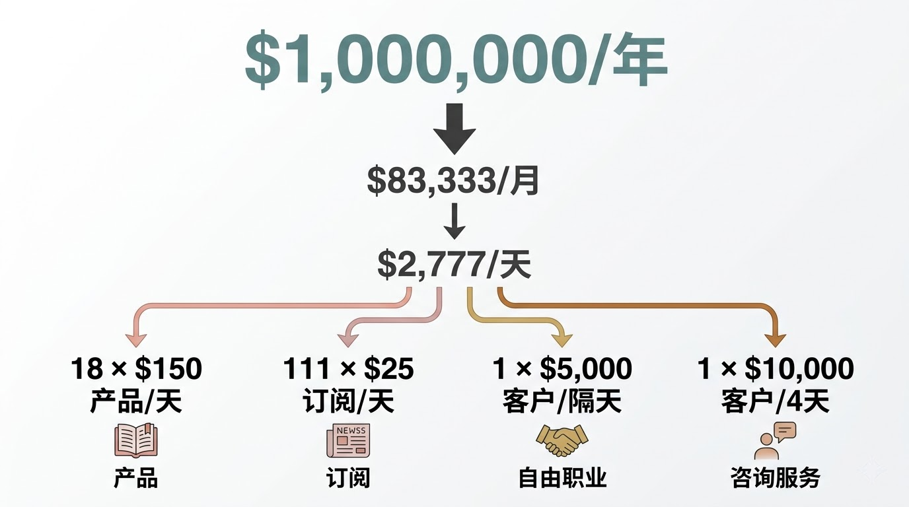
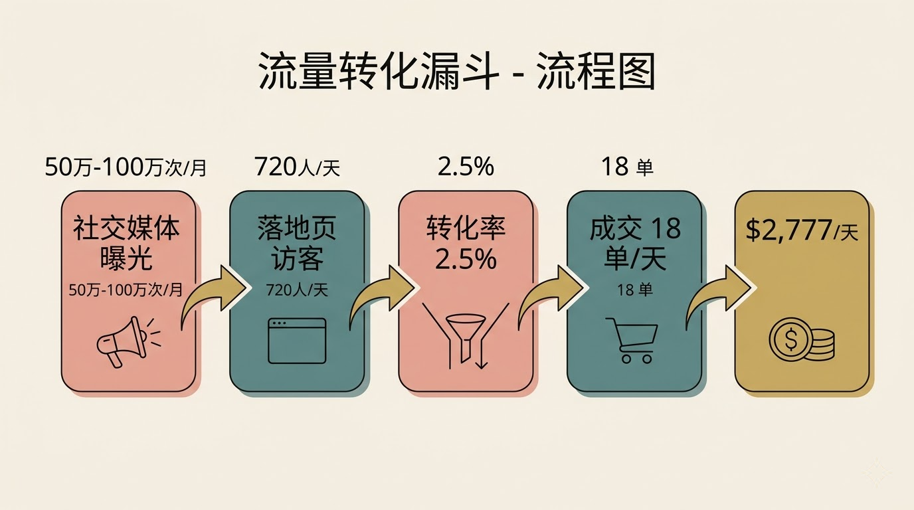
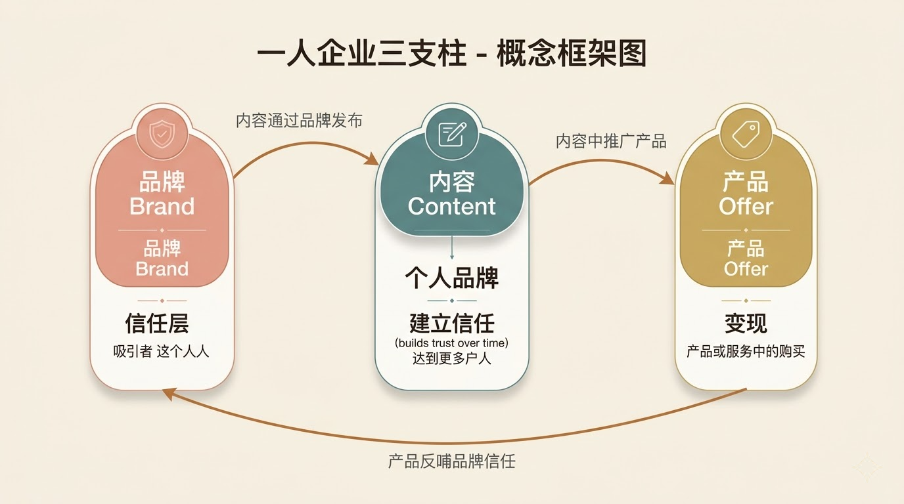
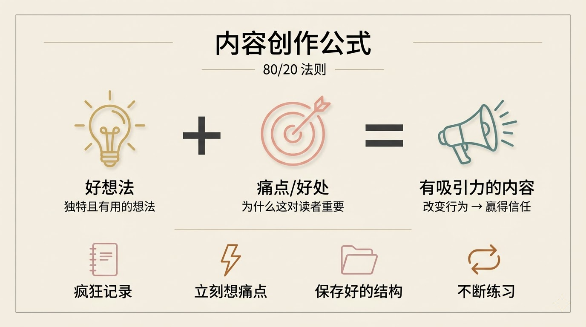
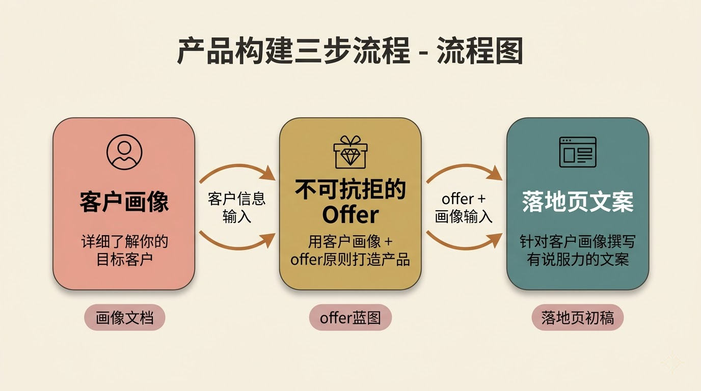
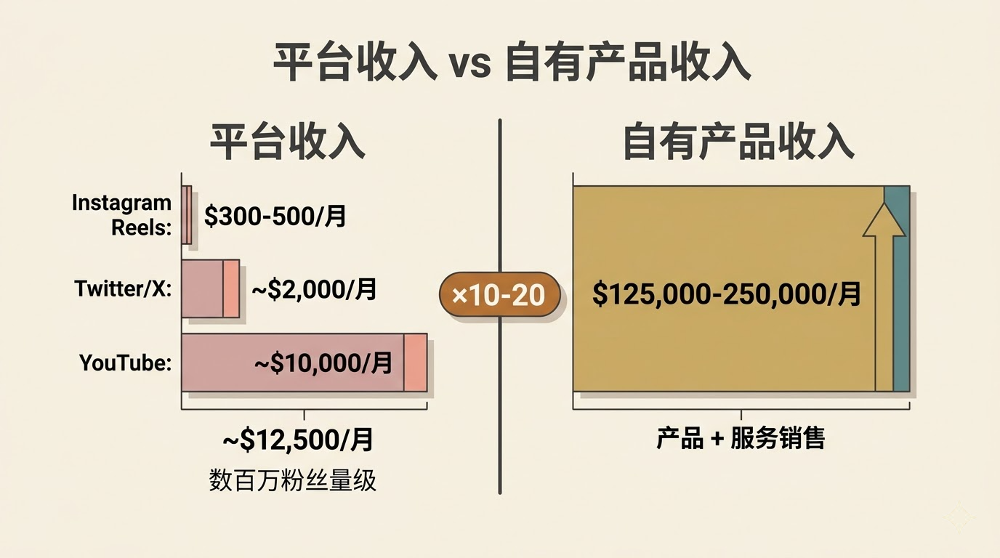

# AI 不会替你赚钱：Dan Koe 谈 2026 年一人企业的真正打法

Dan Koe，个人品牌创作者、作家，写过《The Art of Focus》和《Purpose & Profit》，YouTube 频道有几百万订阅者。过去几年，他的"一人企业"系列视频广受欢迎，如今他正在做一款叫 Eden 的 AI 画布工具，用于内容创作和商业工作流。

这期视频，Dan 从一个问题出发——2026 年，一人企业怎么做？他没有兜售"AI 自动赚钱"的幻想，而是把一人企业的完整链路拆开，在每个环节演示 AI 该怎么用。

---

## 一人企业该做的事没变，变的是速度

Dan 开门见山：2026 年怎么做一人企业？答案是——跟以前一样，只是现在用 AI 加速这个过程。

你不真的需要课程或教练了，虽然这些东西依然有价值——因为有些具体知识你不会想到去问 AI，AI 大概也不会直接给你。
（"You don't really need a course or a coach anymore, although those things are still valuable because there's specific knowledge that you probably wouldn't think to look up with AI."）

他列出了一人企业要做的事：生产内容、写邮件或 newsletter、创建产品或服务、构建客户画像、写一个有说服力的落地页、把产品放到人面前看他们买不买，然后迭代。

Dan 说，作为一个人，你就是市场部、销售部、产品负责人、项目经理、内容写手和社交媒体策略师。你必须成为一个通才。

AI 在这个意义上是催化剂，帮你避免大量试错。
（"AI, in this sense, is a catalyst to avoid a lot of trial and error."）

但他也指出了一个变化：准入门槛降低了，天花板升高了。以前，社交媒体是让一人企业成为可能的技术；现在 AI 让你作为一个人能做更多事，但也意味着更多人会涌入。

---

## 95% 的人在第一次失败后就退出了

Dan 对"AI 自动化一切"的热潮泼了一盆冷水。他观察到，很多人下载 OpenClaw 之类的工具，买一台 Mac mini，让 agent 自动在每个平台发内容。但两三个月后，他们什么都没有。

他们只是喜欢看着 agent 做事，但他们不理解什么是质量。
（"They just like looking at an agent doing things and they don't understand what quality is."）

Dan 和他的商业圈朋友聊过这件事——很多人试过这些自动化工具，体验曲线都很像：一开始觉得太酷了，让 AI 做一切，花了两三百甚至一千美元的 AI 信用额度，然后一切崩塌。

问题出在哪？他们自己不知道"好"长什么样。他们没有技能或知识去做这件事，那怎么可能当好 agent 的经理或 CEO？

---

## 一百万美元的数学题：把它拆到每一天

Dan 说，为了让讨论有个锚点，我们把目标定在 100 万美元——不是说你一定能赚到，而是用这个数字让一切变得可计算。

他做了一道简单的除法：

- 100 万美元 ÷ 12 个月 = 每月 83,333 美元
- 83,333 美元 ÷ 30 天 = 每天 2,777 美元

达到这个日收入，有几种路径：

- 每天卖 18 个 150 美元的产品（比如一门课程）
- 每天新增 111 个 25 美元的订阅（比如在 Substack 上）
- 每隔一天签下 1 个 5,000 美元的客户（自由职业路线）
- 每四天签下 1 个 10,000 美元的客户（咨询或服务路线）
- 或者以上的组合

Dan 说，如果你是新手，他推荐从客户服务入手。原因很直接：卖一个 1,000 到 5,000 美元的服务给一个人，比卖 100 到 200 个 Substack 订阅容易得多。

你今天就可以发 100 条私信。问 AI 怎么写一条好的私信。如果你有一个还不错的 offer，人们可能愿意付钱给你。
（"You absolutely can send 100 DMs today. Ask AI how to send a good DM and if you have a decent offer that people want, they may be willing to pay you."）

---

## 你需要 720 个人每天访问你的落地页

当你从客户服务转向产品销售时，核心问题变成了流量。Dan 又做了一道数学题：

按 2.5% 的落地页转化率计算，要在一个 150 美元的产品上每天成交 18 单，你需要每天有 720 人访问你的落地页。

流量从哪来？社交媒体、Facebook 或 Google 广告、SEO、博客合作、播客赞助、newsletter 赞助——来源很多。但你是一个人，如果你像 Dan 刚开始时一样没什么钱，你大概率会选择社交媒体。

Dan 给出了一个参考值：如果你在社交媒体上变得熟练，你可以做到每条 YouTube 视频 1 万到 5 万次观看，以及每月 50 万到 100 万次社交媒体曝光。从这个基数里导出每天 720 个落地页访客，有挑战但并非不可能。

他也坦率地说，即使达不到这个数字，你也不是零收入。很多人会对低于 100 万的年收入感到满足。

---

Dan 把一人企业拆成三个支柱：品牌、内容、产品/服务。品牌是第一个。

他说，个人品牌本身不产生流量，也不直接卖东西，它是一个信任层——你的内容通过个人品牌发布，你在内容里推广产品，而人们因为信任你，才会对内容和产品产生好感。

在 AI 时代，内容可以无穷无尽，社交媒体将被淹没。人们会转向谁？他们会转向自己信任的人。
（"In the age of AI, when content can be endless and it's going to be flooding social media—what are people going to turn to? They're going to turn to who they trust."）

Dan 分享了他做个人品牌的四条原则：

一，你就是你的 niche。你的信念、经历和兴趣赋予你独特视角，这会体现在内容和产品中。二，你需要几个内容支柱：一个你打算变现的技能或兴趣作为主题，加上两个你停不下来想聊的互补兴趣。三，内容支柱要扎根于痛点——不是自说自话地写，而是让读者理解"这对我有什么用"。四，最终把这些浓缩成一两句话的社交媒体 bio。

关于用 AI 辅助这件事，Dan 的方法是：找到领域专家的 YouTube 视频或书籍，把这些内容喂给 AI，让 AI 拆解其中的原理，然后把这些原理转化为一个 prompt。这个 prompt 可以生成蓝图，也可以充当教练——每天督促你写内容、检查你的 bio、让你汇报进展。

【注：Eden 是 Dan Koe 团队正在开发的 AI 画布工具，目前处于 Beta 阶段。用户可以在画布上粘贴推文、YouTube 视频、markdown 文档和 prompt，并将这些内容连接到 AI 对话中进行交互。】

---

## 内容写作的秘密：让别人觉得这个想法跟自己有关

Dan 说他写了六七年内容，现在看一条推文或一个 YouTube 标题，基本能判断它会不会火——因为模式识别已经到了那个程度。

新手最大的问题是什么？Dan 很直接：你可能有很有趣的想法，但你不会让这些想法对别人产生吸引力。

写内容的秘密是：一，有一个好想法；二，找到它能解决的痛点或带来的好处。你需要把这个"为什么重要"讲好。
（"The secret to writing content is to one, have a good idea, and two, have a pain point it solves or a benefit it gives. And you need to illustrate that reason well."）

他给了一个对比来说明这一点：很多新手写了一条推文，觉得自己是马可·奥勒留。但你没有马可·奥勒留的声望权威——你说什么都有人听的那种。你是一个新号，你必须练习说服力，必须抓住注意力，必须解释清楚"为什么这个想法对你的生活有用"。

Dan 给内容创作者的 80/20 法则：疯狂记录想法——多读书、听播客、反思生活，捕捉独特且有用的想法。捕捉到想法后，立刻想痛点或好处，训练大脑思考"这个想法对别人重要在哪里"。同时保存你喜欢的内容结构，作为新手，用别人的框架，填入自己的话题。然后就是练，写到变成本能。

AI 在内容创作中的角色，Dan 强调的是：用 AI 加速学习。看到一条爆款帖子，把它喂给 AI，问"这条为什么有效？"然后把其中的原则应用到自己的内容上。不是让 AI 替你写然后发出去。

---

## 产品和 offer：大多数人的落地页无聊到没人想买

品牌和内容搞定后，第三个支柱是你卖什么。Dan 说这部分让他有点恼火——他花了五年手动学这些东西，现在 AI 让整个过程容易太多了。

他把产品/offer 的构建拆成三步：第一步，创建详细的客户画像，这是你反复参考的文档，用于所有营销材料。第二步，用客户画像加上 offer 创建原则，打造一个让人无法拒绝的 offer。第三步，把客户画像和 offer 转化为一份有说服力的落地页文案。

Dan 指出大多数人的问题：他们做了一个无聊的产品，然后在落地页上只是罗列产品功能，然后不明白为什么没人买。

关于平台变现 vs. 自有产品，Dan 分享了自己的数据做对比：

- Instagram Reels 奖金：每月 300-500 美元
- Twitter/X：每月约 2,000 美元
- YouTube：每月约 10,000 美元

这是几百万粉丝量级的收入。而通过销售自己的产品或服务，他可以做到 10 到 20 倍。

如果你在考虑接品牌赞助，为什么不自己做一个更好的版本，然后拿走全部利润呢？
（"If you're thinking of accepting sponsors or brand deals from someone, why wouldn't you just create your own version of it and then take all of the profits?"）

---

## AI 差的那个"什么"，不是更多的智能

在视频尾声，Dan 说了一段值得玩味的话：

坦率地说，AI 在现在以及可预见的未来，还没有那么好。它缺了某样东西，而我们不知道那是什么。但可以确定的是，那不是更多的智能。
（"AI frankly still, and probably for the foreseeable future, isn't that good yet. It's missing something, and we don't know what that something is. It's definitely not more intelligence."）

他的判断很清醒：如果任何人都能打开一个 AI agent 然后第二天就赚到几十万美元，那这个东西就是一个 commodity——谁都能做的事不会有持久价值。如果它短期内有效，那只是一个 exploit，会很快被市场消化掉。

你仍然需要学习，仍然需要练习，最重要的是——当某件事不奏效时，你仍然需要迭代，直到它奏效。

---

**几点观察：**

Dan Koe 这期视频表面上在讲"一人企业 + AI"，但他真正想说的其实更底层：工具升级了，能力构建省不掉。这跟技术圈很多人的直觉相反，大家总觉得工具越强，人需要学的越少。Dan 的立场是，工具越强，知道什么是"好"的人反而越稀缺。

一个值得关注的信号是他对 AI agent 自动化的态度。他没有否认 agent 的价值（他自己的产品 Eden 就在做类似的事），但他明确指出大多数人把 agent 当成了多巴胺来源而不是生产力工具。这个观察和当前 AI 圈的 agent 热潮形成了一个有意思的张力。

一个未解的问题：Dan 说 AI"缺了某样东西，不是更多的智能"。那到底缺什么？他没有展开。但这可能是理解当前 AI 能力边界最值得追问的问题之一。

原始视频：https://www.youtube.com/watch?v=VXgusdDbsQE
